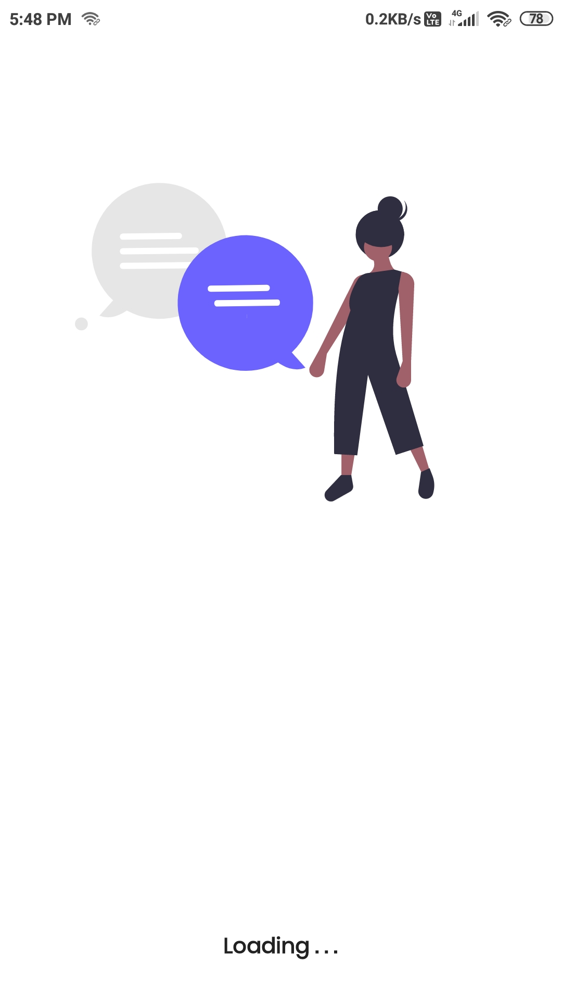
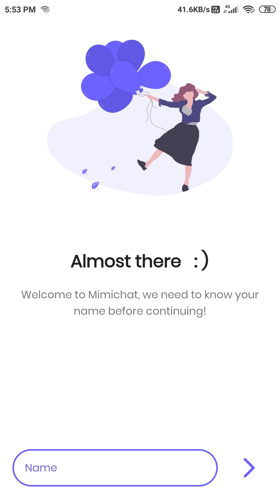
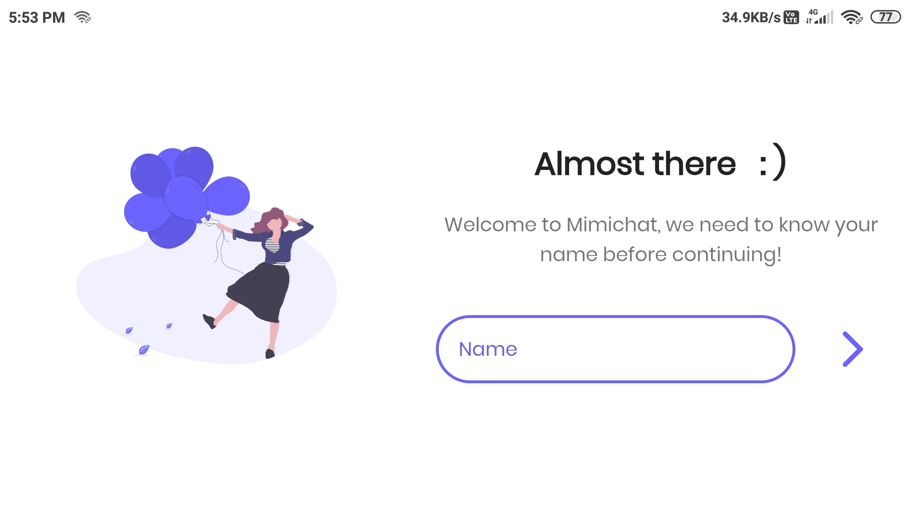
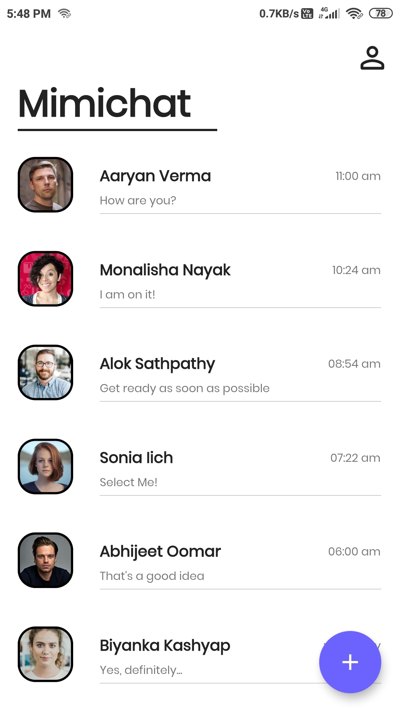
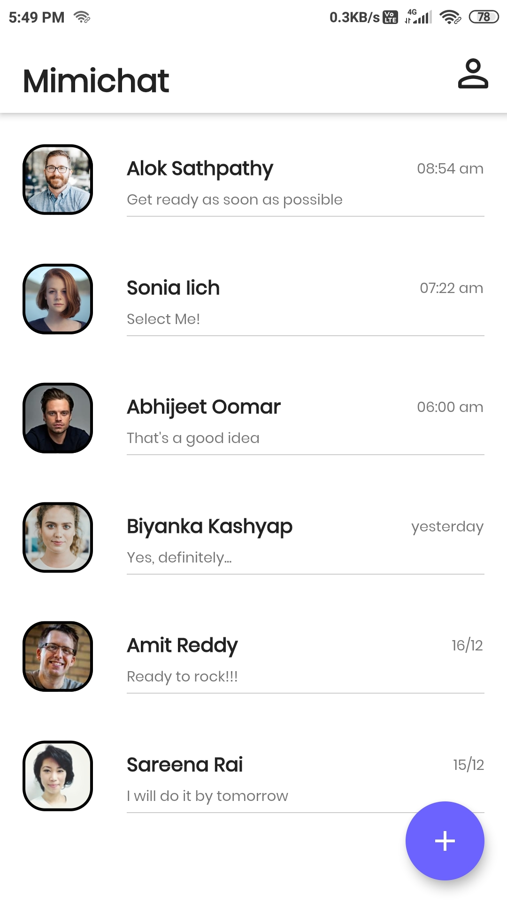
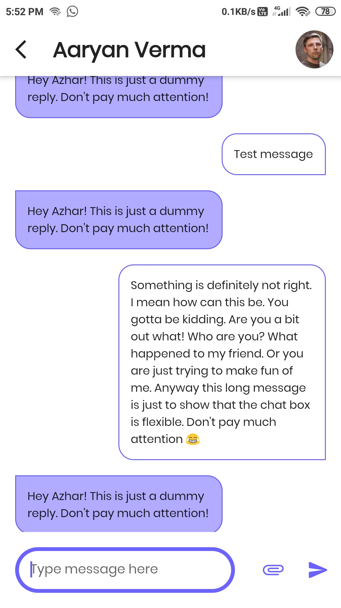
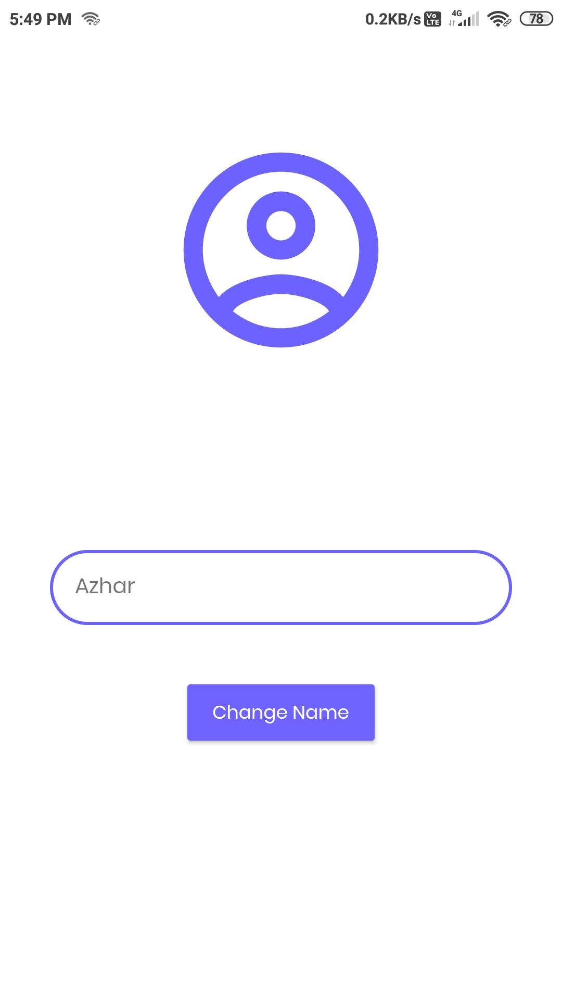

# Mimichat (Mimic + chat = Mimichat) 
## (Only a demo)

A simplistic modern material UI based dummy chat app that mimics a simple conversation. Works in both landscape and portrait mode.

## Includes:
* A splash screen
* An intro screen for first time to ask your name
* A feed screen showing all chats
* A chat screen with:
  - Text message mimic: send a message, you will get a dummy response
  - Attachment mimic: you send an image, receive an audio then you again send a video
  - Auto scrolling to bottom
* A settings screen to change your name

Google drive link to Fat APK: https://drive.google.com/file/d/1f34Io3i4T0tmo9eiAZz-hz-GPzJhGLwb/view?usp=sharing

## How it looks:
### Splash Screen

### Intro Screen
| Portrait | Landscape |
| --- | --- |
|  |  |

### Feed Screen
| Expanded | Condensed |
| --- | ---|
|  |  |

### Chat Screen

### Setting Screen

### Created by Md.Azharuddin
